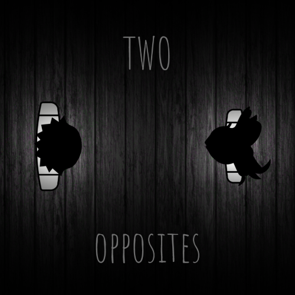
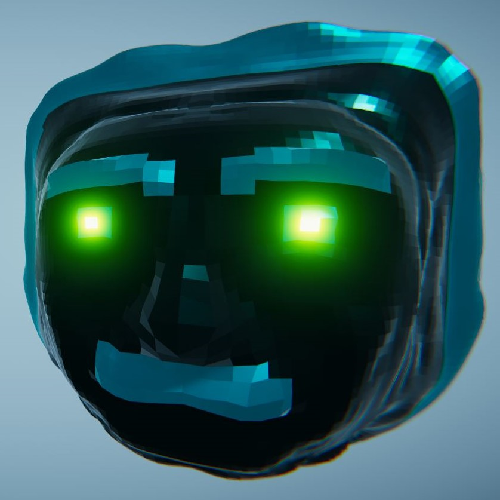
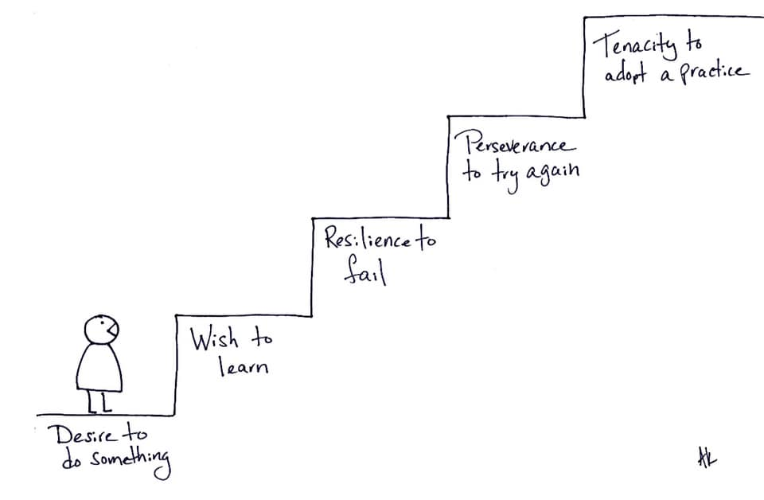

## About Me

I’m a sophomore and the secretary of the game development club at IIT Gandhinagar ([DigiS IIT Gandhinagar](https://www.instagram.com/digis_iitgn/)). I’m into developing games, VFX, editing videos, and simulations. I’ve mentioned some of my work below. If you want the source code/ build of any of these you can contact me! (Few of them are available  on my [Github](https://github.com/aniketrajnish))
## Skills

Type | List
-----|-------|--------
Languages | C#, HLSL, Python, XML, HTML, CSS, JavaScript, C++  
Tools & Technologies | Unity, Adobe Premiere Pro, Adobe After effects, Photoshop, Blender, Adobe XD, MATLAB

> "If development took 69 lines of code, then fixing the bugs would take 420 more" - William Shakespeare

## Games

1. Two Opposites
 * Play [Here](https://makra.itch.io/two-opposites)
 * Made in 7 days for the 2021 Brackeys Game Jam (2nd biggest gamejam on itch with 10k+ participants)
 * Game ranked #22 in the innovation category, #44 in the Game Design category and #71 overall.
2. Faster Than Light (Hypercasual)
 * Play [Here](https://play.google.com/store/apps/details?id=com.makra.FasterThanLight)
 * Won the [JAMBOOST](https://gamejam.com/jam/jamboost) game jam hosted by [Chartboost](https://www.linkedin.com/company/chartboost/) and a prize of 1000$
 * Did fairly well in CPI tests.
 * Got 180$ for promotion.
3. Faster Than Light (PC)
 * Play [Here](https://makra.itch.io/faster-than-light)
 * Made in 7 days for the 2020 Brackeys Game Jam (3nd biggest gamejam on itch with 9k+ participants)
 * Game ranked #71 in Audio category and #132 overall. 
4. Are Ya Winning Son?
 * Play [Here](https://makra.itch.io/are-ya-winning-son)
 * Made in 2 days for the 2020 GMTK Game Jam (Biggest gamejam on itch with 19k+ participants)
 * Game's presentation ranked #221.
5. 2048 Jelly 
 * Play [Here](https://play.google.com/store/apps/details?id=com.Makra.J2048)
6. AFPS
 * Leading a team of 25 individuals working on an Indian themed multiplayer game.
 * Watch the [teaser](https://youtu.be/pLk2W575Z78)
7. Covid 19 Survival Royale
 * An FPS-shooter pandemic simulator I made.
 * Got the first prize in a game jam hosted by my college.
 * Play [Here](https://drive.google.com/a/iitgn.ac.in/file/d/1RTDkU-kCBgqKmpHz13iJLWdAk9BMoVwX/view?usp=drivesdk)
8. Return To Monke
 * Currently under development under a testing deal by [Kwalee](https://www.kwalee.com/)
9. Fertilize.io
 * Play [Here](https://play.google.com/store/apps/details?id=com.makra.fert) 
 * Made in 2-3 days (I was stepping my shoes into game development that time) to be displayed in some Senate Meeting by our current club secretary. This game also includes a        free open source database that I used to create an online leaderboard completely free (without paying google Play’s hefty 25$ cost)
 
*Find more games developed by me [here](https://play.google.com/store/apps/developer?id=DigiS+IIT+Gandhinagar), [here](https://makra.itch.io/), and [here](https://play.google.com/store/apps/dev?id=7545721879938982945)*

## Simulations
 
 * [Realtime Jelly Simulation in Unity](https://youtu.be/fMwoglpPgFk) 
   This simulation was rendered in real-time using Unity. This Project aims at rendering complex simulations like this in real-time which can take hours to render on a decent      PC.
  
 * [Non Euclidean World in Unity](https://youtu.be/wi1RoQJWHbk) 
   Demonstration of a real-time non-euclidean world I made using Unity. This project can be used in puzzle games based on optical illusion. Inspired by the works of CodeParade.
 
 * [Realtime Slime Simulation in Unity](https://youtu.be/a__DdXiYQ-U) 
   2 hours of code, 2 weeks of Fluid Mechanics. Rendered in real-time using Unity. 
   Disclaimer: Couldn't make it look aesthetically appealing as adding a transparent material with a reflection probe attached to so many particles could have possibly fried my    PC.
 * [Fire Simulation in Blender](https://youtu.be/_QH19dipOxY)  
   Done with the help of one of my club members.
   
 * [Putting my simulations to work - 2048 Jelly](https://youtu.be/9tfnqnrit_0)  
   This game uses real-time Jelly-Physics that I developed in Unity. Currently, I'm working on optimizing this code and the game for low-end devices (especially mobile devices).
   Right now, for the cubes to simulate a jelly effortlessly they need around 1.2 million tris each, which is quite resource consuming. Given that by using only 5 of them my PC    (GTX-1050, i5-8250U) could barely hit 60fps. When the game will be optimized enough to run on a high-end mobile device (SD845 or later) then I'll release it. 
  
## Project Holly
 * This project aims at unifying games and movies in ways never done before
 * A platform for completely interactive movies
 * The movies will proceed in the way you want them to
 * Your choices form one of the many perspectives
 * You take control of the protagonist
 * Everything is streamed online so you only use your data for what you want
 * Try the demo [here](https://play.google.com/store/apps/details?id=com.makra.Holly)
 
## POR
 1. Secretary, [DigiS IIT Gandhinagar](https://www.instagram.com/digis_iitgn/)
  * Leading a team of 70 game developers in my college. 
  * In the past 6 months, DigiS has become the most active club and the biggest Game Development College club amongst all IITs.
  * We've been the leading Indian game development team in several game jams.
  * Organized an AR workshop attended by 300 people from IIT Bombay, IIT Hyderabad & IIT Gandhinagar.
  * Organized [Game Jam 2020 AD](https://itch.io/jam/gamejam-2020-ad) in collaboration with [Amalthea IIT Gandhinagar](https://www.instagram.com/amalthea_iitgn/). 609 people         participated to make 96 games making it the third biggest Indian game jam to be held on itch.

 
 2. Eureka Video Coordinator
  * Led a team of 12 video editors.
  * Made the [Foundation Programme Video](https://youtu.be/SLwEwTwHNhM) of Btech'19, IITGn.

## VFX & Edits
  
 * [Messing around with shaders - GameJam 2020 AD Trailer](https://youtu.be/4zfHbw6GRes)  
   I made this trailer using a custom shader that I wrote for Unity. This shader uses one-sided features of multiple planes to give a non-euclidean look (currently working on a    puzzle-game based project that uses this!).  Also, I wrote a shader to replicate the look of HDRP reflective materials using Unity's built-in render pipeline and a reflection    probe. Added the materials based on these shaders to the mascots and the jar!
  
 * [Messing around with VFX Graphs - GameJam 2020 AD Theme Reveal Video](https://youtu.be/kPlAOdrKgbw)  
   I had to make a theme reveal for a game jam that my college is hosting. So I decided to utilize this opportunity and learn VFX graphs in Unity. VFX graphs help to simulate o    over a million particles in real-time. So everything that you see in this video is made out of '2020', which was the theme for the JAM itself.
  
 * [Messing around with Particle Systems - Psychedelic Edit](https://youtu.be/ofWcNlWYwnI)  
   Because Dani said 'You can make anything using Unity's particle system'
  
 * [Recreated Coldplay's Up&Up Music Video](https://youtu.be/gy9gc2orpCY)  
   Rendered using Motion Tracking in Blender and After Effects
   
 * [Recreated Interstellar's Black Hole](https://youtu.be/pGvQrE8Plsc)  
   With 0 budget, blender and the help of my senior.  
   *Fun Fact: Most of the trailers and intro videos for societies, events & fests of IITGn are made on game Engines instead of dedicated editing softwares as it is done by us.*
  

## Misc
 * Love playing [games](https://www.youtube.com/playlist?list=PLQi4IKEYBPHWsrbZpf24op7APre8zRwzH) as much as I love making them.
 * It's evident but yes I have a small [YouTube Channel](https://www.youtube.com/channel/UCK8irXTX_8mbz-ytFiZ96bA)
 * Did [something](https://youtu.be/Jv5gQzI1xhk) in Unity people thought was not possible XD
 * [Made a 2d scene look 3d with lighting](https://youtu.be/lTMu77EimPk)
 * Came across this beautiful [bug](https://youtu.be/7KExwAeeuqs)
 * [Remade Dani's Flash Games in Unity](https://www.youtube.com/playlist?list=PLQi4IKEYBPHUisVkBGx31KaW5VgUB64z2)
 * A [random shitpost game](https://play.google.com/store/apps/details?id=com.makra.KillTheStickMan&hl=en&gl=US) that I made in 15 minutes blew up on play store and is being downloaded by thousands of users everyday.
 * My first unity project was a [FAP Simulator](https://drive.google.com/file/d/14pdEJFl5diFXQK_w2OoOAnTkQGs10Eab/vi) XD

